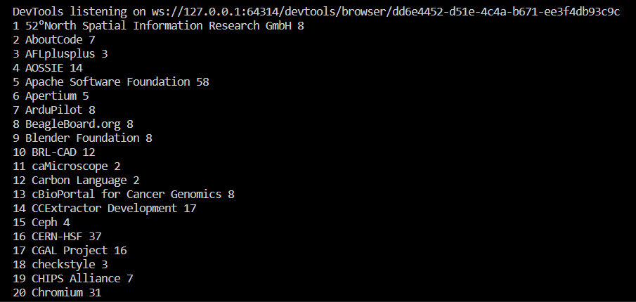

# Google Summer of Code (GSoC) Organization Analysis

The Google Summer of Code is a prestigious program that connects students with open-source organizations, offering them the opportunity to contribute to real-world projects during the summer. Selecting the right organization is crucial for maximizing the chances of being accepted into the program.

## Introduction

This project is designed to scrape and analyze data from the Google Summer of Code (GSoC) official website, specifically focusing on past archive data. The goal is to provide insights into the organizations' selection process and assist potential applicants in making informed choices.

This project aims to streamline the organization selection process by analyzing past GSoC data. By extracting and presenting relevant information, I hope to empower potential applicants with valuable insights into each organization's focus, technologies used, and the number of selected students.

Utilizing web scraping tools such as Selenium for automation and BeautifulSoup for HTML parsing, this project extracts valuable data from the GSoC official website. By harnessing the power of these tools, we aim to provide a seamless and efficient analysis of past GSoC data.


## Features

- **Web Scraping with Selenium:** Automates the data extraction process from the GSoC official website.
- **HTML Parsing with BeautifulSoup:** Parses the HTML content for structured data extraction.
- **Statistics on Selected Students:** Provides insights into the number of selected students for each organization.
- **Focus on Technologies and Topics:** Presents information on the technologies and topics each organization focuses on.

## Setup

Provide step-by-step instructions on how to set up the project. Include any necessary prerequisites and configuration steps.

1. **Clone the repository:**
   
   ```bash
   git clone https://github.com/dee077/GSOC_Organization_Analysis.git
   cd GSOC_Organization_Analysis
   ```

2. **Create and Activate Virtual Environment:**

    ```bash
    python -m venv venv
    .\venv\Scripts\activate
    ```

3. **Install Dependencies:**

    ```bash
    pip install -r requirements.txt
    ```

4. **Setup Selenium:**
    
    Download the appropriate ChromeDriver executable for your operating system from    
    https://sites.google.com/chromium.org/driver/. Place the downloaded chromedriver.exe inside the 
    `chromedriver-win64/` folder in the project directory.

5. **Run the Script:**

    ```bash
    python main.py
    ```
    After running this script, the application will scrape and analyze GSoC data. Check the generated CSV files in 
    the `data/` directory for detailed information on each organization.

    The script allows scraping data for a specific year. To scrape data for a particular year, modify the `year` 
    variable in the `main.py` script.
    
    You can see the list of orginization along with the number of selected students in your terminal as well.
    

## Important Notes

- **Adjusting the Year:**
    To extract data for a different year, modify the `year` variable in the `main.py` script. The URL structure 
    and class targeting should remain constant for the scraping process to work seamlessly.


- **URL Structure Stability:**
    The script relies on the structure of the Google Summer of Code (GSoC) official website's HTML elements. While 
    updates to the website might occur, the stability of the script heavily depends on the persistence of the 
    class 
    names and structure used for data extraction. If the website undergoes significant changes, you may need to 
    adjust the script accordingly.

- **URL Consistency:**
    The script utilizes this URL (`https://summerofcode.withgoogle.com/archive/2023/organizations`) for testing 
    and development purposes. Ensure that the structure of the URLs for organization details remains consistent 
    across different years. If there are changes, update the script accordingly to target the correct HTML 
    elements.

- **Class Targeting:**
    The script targets specific HTML elements using class names. If the classes associated with the elements of 
    interest change, you will need to inspect the HTML structure and update the corresponding class names in the 
    script (`main.py`).

    By keeping these considerations in mind, you can ensure the accurate functioning of the script across 
    different years.

